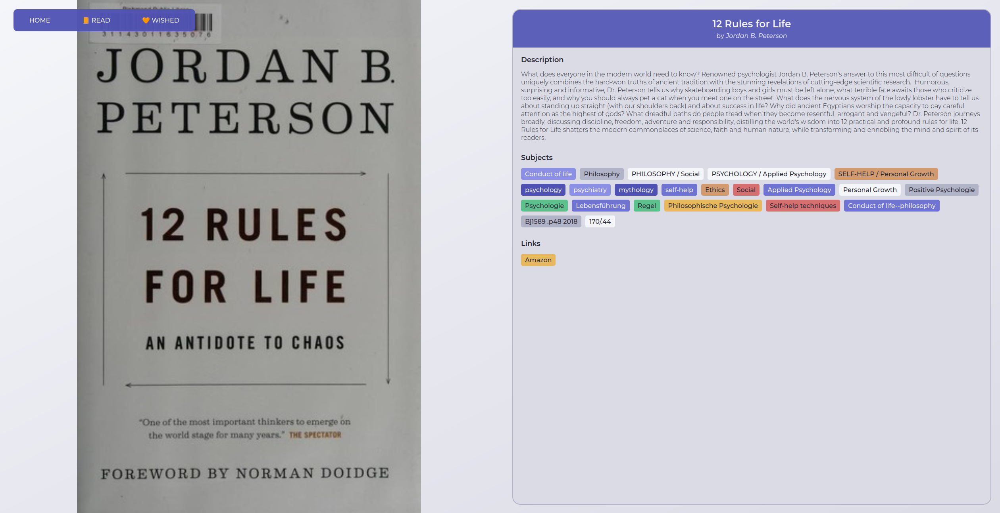

# 🌕 Project's purpose

This is a dummy project whose purpose is to practice these concepts:

- Context and useReducer hook to manage global state.
- Use React Router to manage routes:
  - Regular routes.
  - Nested routes.
  - State management in URL.
    - Params.
    - Query string.
- Style application using CSS Modules.
- Use Vite as build tool.

# 🚀 Features

- Fetch books by title.
- Fetch books by author.
- Fetch random literature-related question and ask it to user.
- Show book details in its own page.
- Show author details in its own page.
- Store read books.
- Store wished books.

# 🗞️ Info

- This project is not meant to be 100% responsive.
- This project is not meant to solve a real life problem.

# External API Documentation

API DOC: https://openlibrary.org/developers/api

# 🖼️ Project's screenshots

## Home page

## Read / Wished page

## Book page

## Author page

